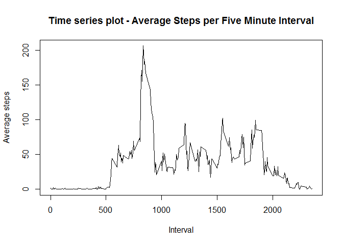
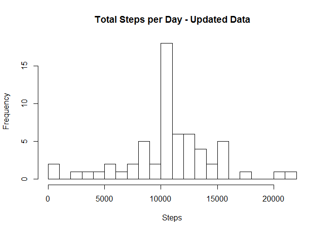

# Reproducible Research - Course Project 1
Hitesh  
February 5, 2016  

#1. Loading and preprocessing the data
Below is the code used to load the csv file provided. Make sure that the file is present in the pwd. Since this assignment will make use of packages like ggplot2, dplyr, lubridate etc. make sure those are already installed. 


```r
library(lubridate)
library(ggplot2)
library(dplyr)
```

```
## 
## Attaching package: 'dplyr'
```

```
## The following objects are masked from 'package:lubridate':
## 
##     intersect, setdiff, union
```

```
## The following objects are masked from 'package:stats':
## 
##     filter, lag
```

```
## The following objects are masked from 'package:base':
## 
##     intersect, setdiff, setequal, union
```

```r
#Load the data
Activity_data_provided <- read.csv("activity.csv", header = TRUE, sep = ',', colClasses = c("numeric", "character", "integer"))
#Transform the date field
Activity_data_provided$date <- ymd(Activity_data_provided$date)
```

#2. What is mean total number of steps taken per day?
This is the first task of the project which is furtner divided into below three subtasks

###2.1 Calculate the total number of steps taken per day


```r
    Total_steps <- Activity_data_provided %>%
    filter(!is.na(steps)) %>%
    group_by(date) %>%
    summarize(steps = sum(steps))

#Number of steps per day
mean(Total_steps$steps)
```

```
## [1] 10766.19
```

###2.2 Make a histogram of the total number of steps taken each day

```r
    hist(Total_steps$steps, main="Histogram - Total Steps per Day", xlab="Steps", ylab="Frequency", breaks=20)
```


###2.3 Calculate and report the mean and median of the total number of steps taken per day

```r
    mean(Total_steps$steps)
```

```
## [1] 10766.19
```

```r
    median(Total_steps$steps)
```

```
## [1] 10765
```

#3. What is the average daily activity pattern?
This is the second task of the project which is further divided into 2 sub parts
###3.1 Make a time series plot (i.e. type = "l") of the 5-minute interval (x-axis) and the average number of steps taken, averaged across all days (y-axis).

```r
    steps_interval_data <- aggregate(steps~interval, data = Activity_data_provided, mean, na.rm = TRUE)
    plot(steps_interval_data$interval, steps_interval_data$steps, type="l", main="Time series plot - Average Steps per Five Minute Interval", xlab="Interval", ylab="Average steps")
```



###3.2 Which 5-minute interval, on average across all the days in the dataset, contains the maximum number of steps?
The following output shows the interval for which the dataset contains maximum number of steps

```r
    steps_interval_data[which.max(steps_interval_data$steps),]
```

```
##     interval    steps
## 104      835 206.1698
```

#4 Imputing missing values
This is the third task of the project which is further divided into 3 sub parts
###4.1 Calculate and report the total number of missing values in the dataset (i.e. the total number of rows with NAs)
The following are the total number of the missing data in the original activity data set provided

```r
    sum(is.na(Activity_data_provided$steps))
```

```
## [1] 2304
```

###4.2 Devise a strategy for filling in all of the missing values in the dataset. The strategy does not need to be sophisticated. For example, you could use the mean/median for that day, or the mean for that 5-minute interval, etc.

The strategy is to replace the NA values by the mean value of the data set

###4.3 Create a new dataset that is equal to the original dataset but with the missing data filled in.
As stated, we'll replace the missing values with the mean of the data set

```r
    No_NA_data <- Activity_data_provided
    No_NA_data$steps[is.na(No_NA_data$steps)] <- mean(No_NA_data$steps, na.rm=TRUE)
```

###4.4 Make a histogram of the total number of steps taken each day and Calculate and report the mean and median total number of steps taken per day. 

```r
    New_steps_data <- aggregate(steps ~ date, data=No_NA_data, sum, na.rm=TRUE)
    hist(New_steps_data$steps, breaks=20, main="Total Steps per Day - Updated Data",
    xlab="Steps", ylab="Frequency")
```


The mean and median steps data with the new approach (replacing NA values with the mean) are as below

```r
    mean(New_steps_data$steps)
```

```
## [1] 10766.19
```

```r
    median(New_steps_data$steps)
```

```
## [1] 10766.19
```

After imputing the missing data with the average number of steps in the same 5-min interval, both the mean and the median are equal to the same value, which is also the mean value of the initial data set


#5. Are there differences in activity patterns between weekdays and weekends?
This task is further divided into two sub tasks

###5.1 Create a new factor variable in the dataset with two levels - "weekday" and "weekend" indicating whether a given date is a weekday or weekend day


```r
    No_NA_data$date <- as.Date(No_NA_data$date)
    No_NA_data$dayname <- weekdays(No_NA_data$date)
    No_NA_data$weekend <- as.factor(ifelse(No_NA_data$dayname == "Saturday" | No_NA_data$dayname == "Sunday", "weekend", "weekday"))
```

###5.2 Make a panel plot containing a time series plot (i.e. type = "l") of the 5-minute interval (x-axis) and the average number of steps taken, averaged across all weekday days or weekend days (y-axis). 

```r
    library(lattice)
    plotdata <- aggregate(steps ~ interval + weekend, No_NA_data, mean)
    xyplot(steps ~ interval | factor(weekend), data=plotdata, aspect=1/3, type="l")
```


